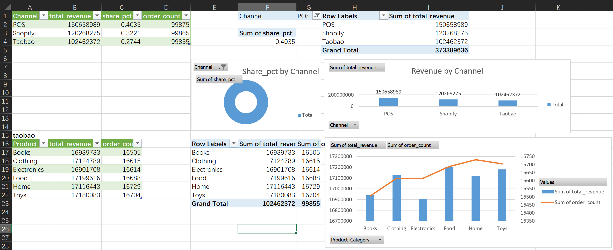
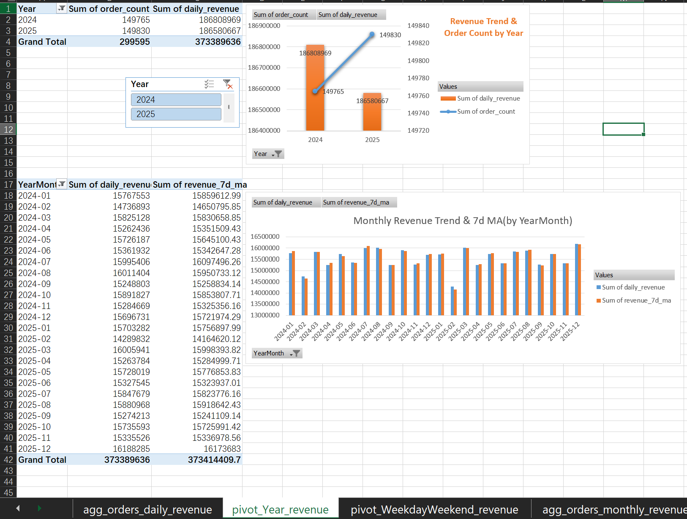

# eCommerce Sales Analysis

> An end-to-end data analytics project simulating a multi-channel retail business (Taobao, Shopify, POS) across 2024–2025. The project covers the full data pipeline — from raw data generation and ETL, to SQL-based business logic, to interactive dashboards in Excel and Tableau, and finally to business insights with actionable recommendations.


## 📊 Dashboard Previews
### Excel Dashboards



### Tableau Dashboards


## 🛠️ Tech Stack
| Layer | Tools & Languages |
| :--- | :--- |
| **Data Generation** | Python 3.12+ (Pandas, random) |
| **ETL Pipeline** | Python 3.12+ (Pandas, SQLite3) |
| **Data Modeling** | SQL (SQLite, window functions, CTEs) |
| **Visualization (Excel)** | Power Query, PivotTables, PivotCharts, Slicers |
| **Visualization (Tableau)** | Tableau Public 2026.2 (Dual-axis charts, dashboards, filters) |
| **Business Documentation** | Markdown (insights.md, README.md) |
| **Version Control** | Git / GitHub |


## 📁 Project Structure
eCommerce Analysis/

├── data/

│ ├── raw/ # Raw CSV files (generated by generate_data.py)

│ │ ├── orders_taobao.csv

│ │ ├── orders_shopify.csv

│ │ └── orders_pos.csv

│ └── processed/

│ ├── ecommerce.db # SQLite database (final cleaned data)

│ └── exports/ # Exported views as CSV (for Tableau / Excel)

│ ├── agg_orders_daily_revenue.csv

│ ├── agg_orders_channel_revenue.csv

│ ├── agg_orders_monthly_revenue.csv

│ ├── agg_orders_taobao_revenue.csv

│ ├── agg_orders_shopify_revenue.csv

│ ├── agg_orders_payment_method_share.csv

│ └── agg_orders_daily_channel.csv

├── python/

│ ├── generate_data.py # Simulate raw order data

│ ├── ETL_pipeline.py # Clean, transform, and load into SQLite

│ ├── create_views.py # Create SQL views from aggregations.sql

│ └── export_views.py # Export views to CSV

├── sql/

│ └── aggregations.sql # SQL view definitions (window functions, CTEs)

├── excel/

│ └── operations_dashboard.xlsx # Interactive Excel Dashboard

│ └──screenshots/# Dashboard screenshots 

├── tableau/

│ └── files

│ │ ├── eCommerce Analysis.twb

│ │ ├── eCommerce Analysis.twbx

│ └── screenshots/ # Dashboard screenshots for README

├── insights.md # Full business insights report

└── README.md # This file


## 🔧 Environment Setup

### Prerequisites
- **Python 3.12+** (recommended: 3.12 or later)
- **Tableau Public** (free) or **Tableau Desktop** (trial)
- **Microsoft Excel** (2019+ recommended)

### Python Dependencies
bash
```
pip install pandas
sqlite3 is built-in with Python 3.x. No separate installation is required.
```
## 🚀 How to Run
1. Generate Raw Data
bash
```
cd python
python generate_data.py
```
2. Run ETL Pipeline
bash
```
cd python
python ETL_pipeline.py
```
3. Create SQL Views
bash
```
cd python
python create_views.py
```
4. Export Views to CSV
bash
```
cd python
python export_views.py
```
5. Explore Dashboards
Excel: Open excel/operations_dashboard.xlsx
Tableau: Open tableau/eCommerce Analysis.twbx

## ✅ How to Verify the Pipeline Works
After running the pipeline, you should see the following outputs:

data/processed/ecommerce.db → ~50MB SQLite file containing all cleaned data.
data/processed/exports/*.csv → 7 CSV files (daily, channel, monthly, etc.).

ETL output:

text
ETL completed. Total rows: 300000
Create views output:

text
✅ Executed successfully: DROP VIEW IF EXISTS agg_orders_daily_revenue...
✅ Executed successfully: CREATE VIEW agg_orders_daily_revenue AS...

🎉 All views created successfully!
Export views output:

text
✅ EXPORTED: agg_orders_daily_revenue -> data/processed/exports/agg_orders_daily_revenue.csv (731 Rows)

🎉 EXPORTED ALL THE VIEWS SUCCESSFULLY!

## 📊 Data Dictionary
This project uses simulated eCommerce data covering 2024–2025 across three channels:

Channel	Description	Payment Methods	Key Fields

Taobao	Domestic online platform	Online payments (Alipay, etc.)	Category, Customer_ID

Shopify	Cross-border independent store	Credit Card, PayPal	City (US cities), Refund

POS	Offline retail stores	Alipay, WeChat Pay, Cash, Credit Card	Payment_Method

The dataset includes ~300,000 orders (100K per channel), with daily and monthly aggregations pre-computed via SQL views.

## 📌 Data Refresh Workflow
When new data is generated or SQL logic changes:

Re-run ETL → python python/ETL_pipeline.py

Re-create views → python python/create_views.py

Re-export CSVs → python python/export_views.py

Refresh dashboards:

Excel: Click Data → Refresh All

Tableau: Click Data → Refresh All Data Sources

## 📈 Key Business Insights
The full analysis is documented in insights.md. Below is a summary:

1. Seasonal Patterns
February is consistently the lowest-revenue month, driven by the Spring Festival holiday.
March shows a strong rebound, confirming the February dip is temporary.
December is the year-end peak (≈16.2M), with a 3.13% YoY increase in 2025.

2. Channel Contribution
POS is the largest single channel (~150.7M), with Alipay (25.18%) and WeChat Pay (25.03%) dominating offline payments.
Shopify is the second-largest (~120M), outperforming Taobao (~102M), suggesting strong cross-border growth potential.

3. Weekday vs Weekend
POS shows a marginal weekend advantage (+0.65%).
Shopify and Taobao perform better on weekdays (‑1.80% and ‑1.29% weekend decline).
Overall weekday-weekend gap is < 2%, confirming that channel strategy matters more than day-of-week adjustments.

4. Actionable Recommendations
Align post-holiday promotions with the actual Spring Festival recovery window (3–5 days for early festivals; delay to early March for late festivals).
Treat Valentine's Day as a standalone campaign only when the calendar gap exceeds 10 days.
Increase inventory by 20–30% for gifting categories (electronics, beauty, packaged food) before major peaks.

## 📄 License
This project is for educational and portfolio purposes only. All data is simulated.

##  About the Author
Carmen Wang — Data Analyst passionate about transforming raw data into actionable business insights.
GitHub: https://github.com/MengyiWang-W