# Business Insights: 2024–2025 eCommerce Sales Analysis

## Executive Summary
This document consolidates key findings from the 2024–2025 eCommerce sales data, covering three core dimensions: seasonal patterns and holiday effects, channel contribution structure, and weekday–weekend performance dynamics. Each insight is supported by data evidence and translated into actionable business recommendations.

---

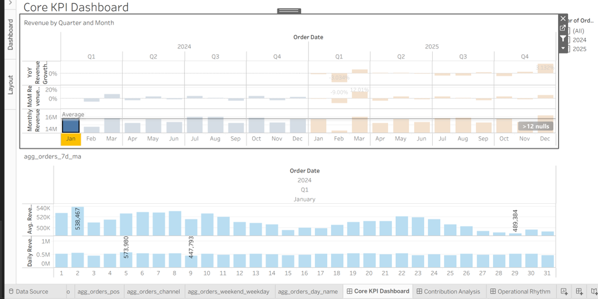
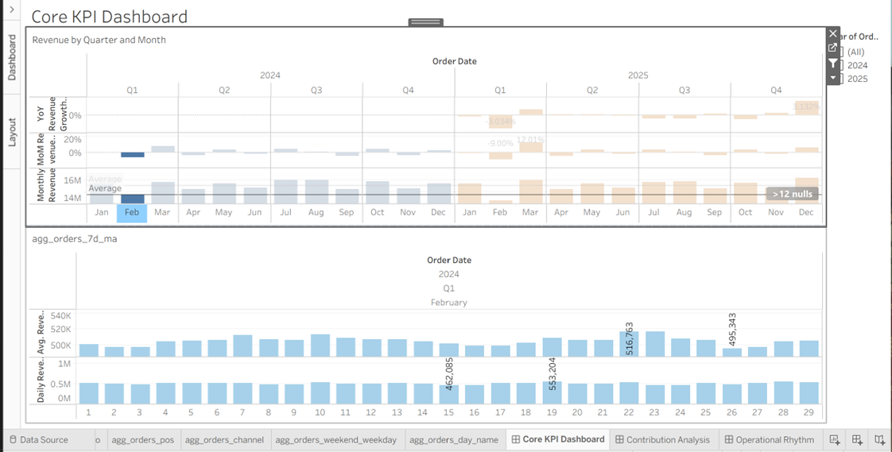
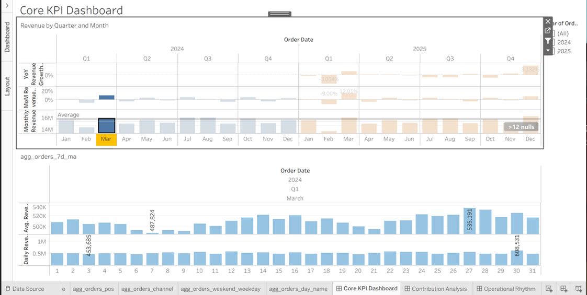
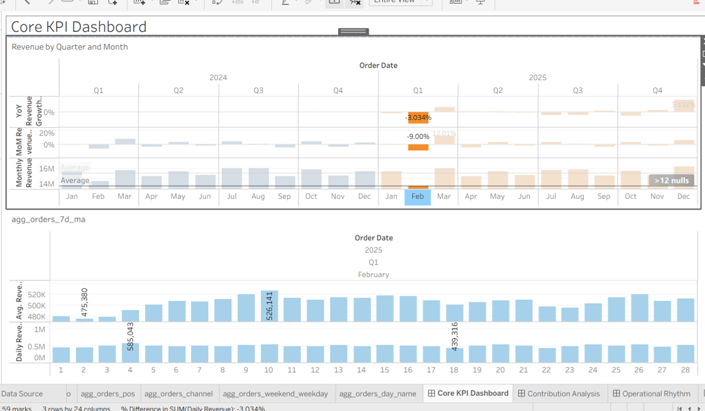

## 1. Seasonal Patterns & Holiday Effects

### 1.1 Spring Festival Effect

#### Key Findings
1. February consistently records the lowest monthly revenue and the largest MoM and YoY declines in both 2024 and 2025 — across all channels. This pattern is observed uniformly across Taobao, Shopify, and POS, confirming it as a business-wide seasonal event rather than a channel-specific anomaly.
2. March consistently shows the strongest rebound in both years, confirming the February dip is seasonal and temporary.
3. The recovery duration varies significantly between years, directly correlating with the timing of the Spring Festival.
4. Valentine‘s Day drives incremental revenue only when it is temporally separated from the Spring Festival (≥ 10 days gap). When overlapping, its impact is absorbed by the broader holiday spend.

#### Root Cause Analysis
The February decline aligns precisely with the Spring Festival holiday period:

- **2024**: Spring Festival (Feb 10–17) coincided with a late January–early March trough (~6 weeks). Recovery was prolonged by the late holiday timing. Valentine’s Day (February 14) fell within the Spring Festival window. Any potential spending was absorbed by the broader holiday expenditure (e.g., Lunar New Year gifting and family gatherings), resulting in no observable independent uplift.

- **2025**: Spring Festival (Jan 28 – Feb 4) ended early, allowing recovery to begin immediately after Feb 4 (~1 week trough). The early holiday also created a two-week gap before Valentine’s Day (Feb 14). With household spending budgets no longer constrained by the holiday, Valentine’s Day contributed to a visible demand boost, supporting the steady recovery starting immediately after February 4.

#### Business Implications & Actionable Recommendations
1. **Promotion timing**: For early Spring Festivals (late Jan – early Feb), schedule post-holiday promotions to start within 3–5 days after the holiday ends. For late Spring Festivals (mid–late Feb), delay promotions to early March to align with actual recovery patterns.
2. **Budget Allocation**: Treat Valentine’s Day as a standalone campaign only when the calendar gap from the Spring Festival exceeds 10 days. When the gap is smaller, consolidate Valentine‘s marketing spend into the broader Spring Festival campaign to avoid diluting impact.
3. **Inventory planning**: Allocate 15–20% of Q1 inventory buffer for the two weeks following the Spring Festival to accommodate post-holiday fulfillment, especially for categories tied to gifting (e.g., electronics, beauty, and packaged food).
4. **2026 forecasting**: Use the 2024 and 2025 seasonal patterns as a baseline to forecast the 2026 February dip and March recovery, adjusting for the specific Spring Festival date.

#### Summary
The 2024–2025 revenue data shows a clear and repeatable seasonal cycle driven by the Spring Festival, with recovery pace and adjacent holiday performance determined by the timing of the holiday. These findings provide a data-backed framework for 2026 promotional scheduling, inventory management, and campaign planning.

---

### 1.2 2025 YoY Revenue Growth

#### Key Findings
1. February 2025 YoY revenue growth declined by **3.03%** , reflecting a significant year-over-year drop.
2. The decline is directly attributable to the **earlier timing of the 2025 Spring Festival** (January 29), which concentrated the holiday‘s business disruption entirely within the February reporting window.
3. The impact proved **short-lived**: March 2025 showed a strong rebound, consistent with the post-holiday recovery pattern observed across the broader business.
4. A YoY comparison for February 2024 is **not available**, as the data series begins in 2024.

#### Root Cause Analysis
The February 2025 YoY decline is rooted in a calendar-driven distortion rather than a deterioration in business performance:

- **2025 Spring Festival Timing**: The holiday fell on January 29, placing the majority of its business disruption (logistics pauses, workforce absence, reduced consumer activity) squarely inside the February reporting period. This compressed the negative impact into a single month, making February‘s YoY performance appear significantly worse than it would have been if the holiday had fallen later.

- **2024 Context**: The Spring Festival in 2024 fell on February 10, meaning the 2024 February reporting period was not fully comparable — it included both pre-holiday and early post-holiday activity, while 2025 February was almost entirely post-holiday recovery. The lack of a direct 2024 YoY baseline for February further reinforces that this is a timing issue, not a business trend.

- **Recovery Signal**: The strong March 2025 rebound (consistent with the broader seasonal pattern) confirms that the February drop was a temporary disruption rather than a structural decline. This aligns with the cross-channel recovery pattern observed in both 2024 and 2025, where March consistently rebounds after the Spring Festival dip.

#### Business Implications & Actionable Recommendations
1. **Inventory Management**: Reduce non-essential replenishment orders during the Spring Festival week (Jan 28 – Feb 4) to avoid post-holiday stockouts during the business pause. Resume normal ordering in the second week after the holiday and increase inventory for Valentine‘s Day-linked categories (e.g., gifts, beauty, electronics) by 20–30% starting 3 days before Feb 14 to capture the post-holiday demand surge.
2. **Budget Allocation**: Allocate a standalone Valentine’s Day marketing budget when the holiday falls outside the Spring Festival window (as in 2025). This ensures independent campaign planning and prevents dilution by the larger Spring Festival spend.
3. **Timing**: Launch post-holiday promotions within 3–5 days after the Spring Festival ends to align with the recovery window, and layer Valentine‘s Day campaigns 5–7 days before Feb 14 to maximize overlap with consumer shopping behavior.

#### Summary
The February 2025 YoY decline of -3.03% is a calendar-driven anomaly rather than a signal of weakening business performance. The early Spring Festival compressed disruption into a single month, while the strong March rebound confirms the underlying business remains healthy. This highlights the importance of contextualizing YoY comparisons — particularly when holiday timing shifts between years — and adjusting inventory, budget, and promotion calendars accordingly.

---

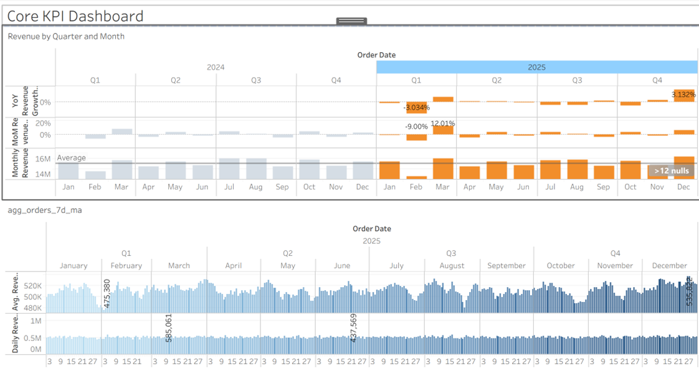

### 1.3 Seasonal Revenue Peaks & Troughs

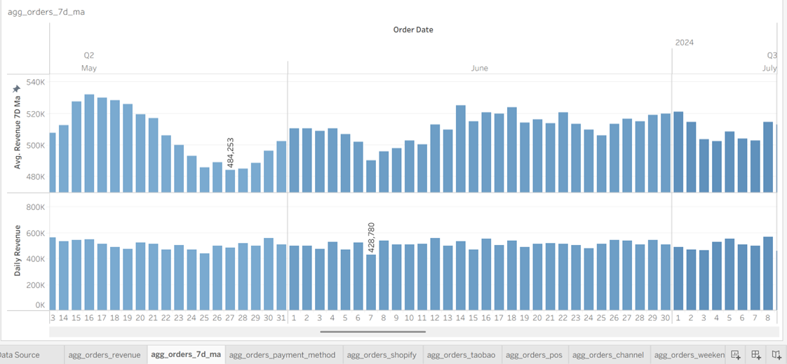
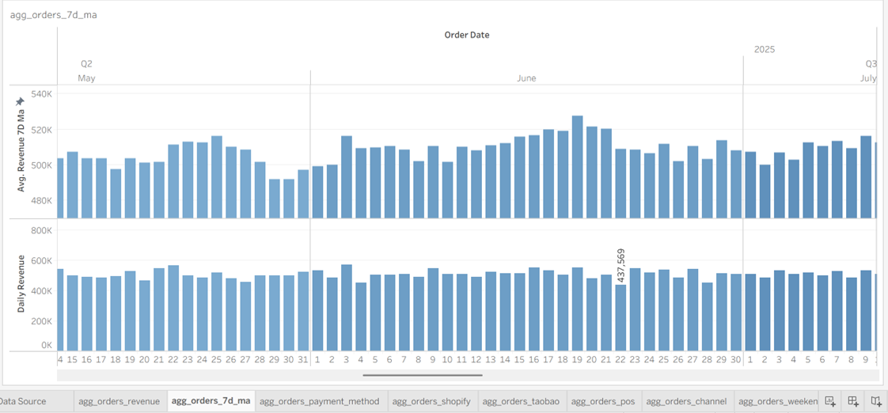
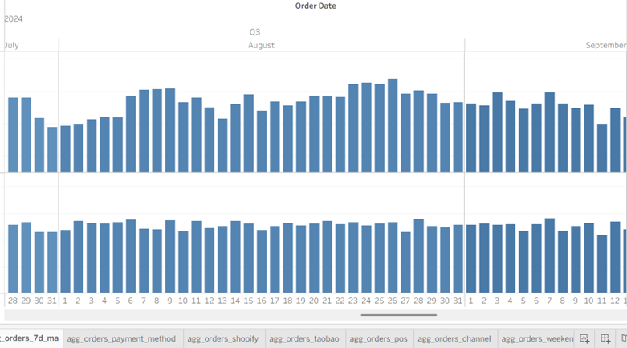
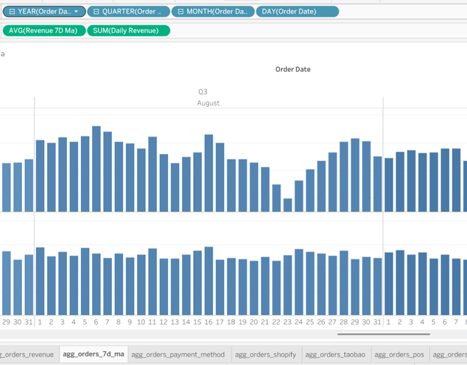

#### July–August: Summer Secondary Peak
July and August consistently rank among the above-average revenue months in both 2024 and 2025, with positive MoM growth. This pattern aligns with summer vacation spending.

**Actionable Recommendations:**
- **Inventory**: Complete summer category inventory build-up by May 25, before school summer vacations begin. Maintain elevated stock levels through August 20. Allocate 15–20% of total summer inventory budget to a “back-to-school” mini-peak in the last week of August.
- **Promotions**: Launch summer campaign bundles on July 1, with a secondary back-to-school promotion starting August 20 to capture school preparation spending. Allocate 60% of July–August marketing budget to the first two weeks of July, and the remaining 40% to the back-to-school window.
- **Measurable Goal**: Achieve combined July–August revenue ≥ 15% above the April–June quarterly average.

#### December: Year-End Peak
December 2025 recorded the highest monthly revenue (≈16.2M) and a 3.13% YoY growth increase, marking the strongest year-end performance. This seasonal uplift is consistent with Christmas and New Year consumer spending.

**Actionable Recommendations:**
- **Inventory**: By November 20, increase inventory for high-demand gift categories (e.g., lighting gifts, festive products, electronics) by 20–30% over November baseline levels. Maintain a buffer of at least 10% above expected daily sales from December 20–31 to cover last-minute surges.
- **Promotions**: Launch holiday campaigns (countdown deals, gift bundles) on December 1, with primary spend concentrated in the first three weeks. Reduce ad spend by 30% after December 25, as post-holiday demand typically drops sharply.
- **Measurable Goal**: Achieve a month-over-month revenue increase of ≥15% from November to December.

#### February, April, June, September, November: Trough Months
These months consistently fall below the monthly average, with February recording the deepest drop (≈14.3M in 2025) due to the Spring Festival. April, June, September, and November represent post-peak corrections or seasonal lulls, with limited organic growth drivers.

**Actionable Recommendations:**
- **Inventory**: Reduce replenishment orders by 10–15% compared to baseline months to avoid overstock during low-demand periods. For February, halt non-essential replenishment during the Spring Festival week and resume normal ordering on the 4th day after the holiday ends.
- **Promotions**: Run 48-hour flash sales or clearance events during these months, with discount depths of 10–15% off regular prices (limited to slow-moving inventory). Avoid large-scale promotional campaigns that require heavy inventory commitments.
- **Measurable Goal**: Limit revenue decline in these months to ≤5% below the previous month (for non-February trough months) and ≤10% for February, aligning with historical seasonal patterns.

---

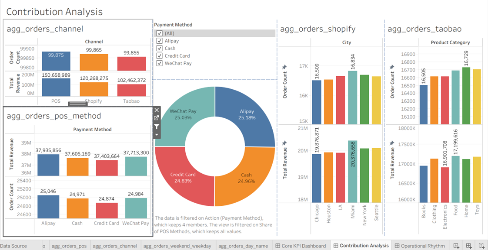

## 2. Channel Contribution Analysis

### 2.1 POS (Offline Channel)

**What**
POS is the largest revenue-contributing channel, generating approximately **$150.7M** in total revenue. Within this channel, **Alipay (25.18%)** and **WeChat Pay (25.03%)** together account for over half of total payment revenue and order count.

**Why**
The high penetration of mobile payment systems in China‘s offline retail environment has made Alipay and WeChat Pay the default payment methods for most consumers. The seamless integration between online and offline payment experiences not only improves transaction completion rates but also enables brands to consolidate customer data across channels, supporting unified customer profiles for better targeting.

**How**
1. **Unify online and offline payment data**: Link POS payment records with online order data to build a single customer identity system, supporting cross-channel behavior analysis and personalized marketing.
2. **Increase mobile payment penetration in select locations**: In stores where Cash and Credit Card usage remains high, use incentives such as red envelopes or discounts to encourage customers to switch to mobile payments, improving data coverage and operational efficiency.

### 2.2 Shopify (Cross-Border Channel)

**What**
Shopify is the second-largest revenue channel, generating approximately **$120M** in revenue and nearly **100K** orders. Its revenue contribution exceeds that of Taobao, trailing only behind POS.

**Why**
Chinese brands are increasingly expanding into overseas markets, and Shopify provides a flexible, direct-to-consumer channel that bypasses the constraints of platform-based marketplaces. Compared to Taobao, Shopify faces lower competitive pressure and typically supports higher gross margins.

**How**
1. **Prioritize Shopify in 2026 strategic planning**: Allocate an additional 15–20% marketing budget to Shopify campaigns to capture cross-border growth momentum.
2. **Optimize local operations by city**: Use city-level sales data (e.g., Miami, Seattle) to tailor product assortments and promotional strategies for different regional markets.
3. **Plan for year-end peak seasons**: For key shopping events (Thanksgiving, Black Friday, Christmas), begin inventory build-up and campaign material preparation by the end of October.

### 2.3 Taobao (Domestic Online Channel)

**What**
Taobao generates approximately **$102M** in revenue, with **Food (~$17.2M)** and **Clothing (~$17.1M)** as the top two categories, together accounting for roughly **33%** of Taobao‘s total revenue. **Books** ranks among the lowest-performing categories.

**Why**
Food and Clothing benefit from large customer bases and high transaction volumes, but face intense competition due to algorithm-driven recommendations and a high density of similar products. Books, on the other hand, have seen declining demand as digital reading platforms (e.g., WeChat Reading) continue to replace physical book purchases for a growing share of consumers.

**How**
1. **Differentiate in Food and Clothing**: Focus on niche sub-segments (e.g., healthy snacks, functional apparel) to differentiate through product positioning and packaging, rather than competing solely on price.
2. **Strengthen campaign timing**: Align promotional efforts with proven sales windows — 618, Double 11 (Singles‘ Day), Valentine’s Day, and Mother‘s Day — and launch campaign preparation 3–4 weeks in advance.
3. **Adjust Books strategy**: Reduce inventory commitments for Books, and explore digital or subscription-based alternatives to capture limited demand while minimizing physical stock risk.

### 2.4 City-Level Insight (Shopify)

Among major U.S. cities, Miami records the highest revenue. In a real-world scenario, this would warrant further investigation into whether the uplift is driven by higher average order value or stronger seasonal demand, and whether it is cyclical or one-time. For simulation purposes, we treat this as a hypothesis for future validation.

**Actionable Recommendations:**
- **Inventory**: Increase inventory for Miami-tailored categories (e.g., surfwear, swimwear, travel accessories, souvenirs) by 20–30%, with stock readiness by November 20 and maintained through April.
- **Promotions**: Launch campaigns targeting Miami travelers from late November, aligning with the start of the U.S. winter travel season. Reduce ad spend by mid-March, as demand typically stabilizes after peak travel period.

---

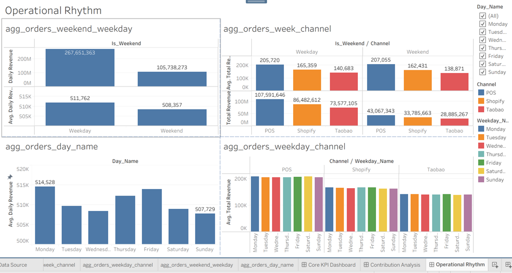

## 3. Channel-Level Weekday vs Weekend Performance

### Key Findings
1. At the individual channel level, **POS generates the highest daily revenue (~206K)**, outperforming Shopify (~164K) and Taobao (~140K), indicating strong offline operational efficiency. However, when combined, the two online channels (Shopify + Taobao) collectively account for approximately **1.5 times** the daily revenue of POS, confirming that the brand‘s overall revenue remains heavily reliant on digital commerce. Among online channels, Shopify consistently outperforms Taobao, suggesting that cross-border sales represent a more efficient growth lever than domestic e-commerce under the current strategy.
2. **POS is the only channel with a weekend advantage**, though marginal — weekend revenue is 0.65% higher than weekdays.
3. **Shopify and Taobao both show a weekday preference** — Shopify weekday revenue is 1.80% higher, and Taobao weekday revenue is 1.29% higher than weekends.
4. **Across all channels, the weekday–weekend gap is narrow (< 2%)**, confirming that time of week is not a primary revenue driver. **Channel strategy is the true lever for growth.**

### Root Cause Analysis
The data points to a classic “utility vs. experience” consumer behavior pattern:

- **Weekdays** — Consumers shop online during commute hours, lunch breaks, or downtime. This drives Shopify and Taobao performance.
- **Weekends** — Consumers shift toward offline experiences (shopping malls, dining, leisure), giving POS a slight edge, while online activity softens.

The small magnitude of the gap suggests that the business is **not highly sensitive to the weekly calendar** — unlike categories such as hospitality or entertainment — and that channel-specific factors (pricing, convenience, product assortment) dominate performance.

### Business Implications & Actionable Recommendations

| Channel | Implication | Recommended Action |
| :--- | :--- | :--- |
| **Taobao** | Weekday traffic and conversion are stronger | Concentrate flash sales and livestream events on **Thursday – Friday**; use weekends for browsing and wish-list building. Offer “Monday-only” coupons to drive early-week conversions. |
| **Shopify** | Cross-border customers are more active on weekdays | Align email marketing (EDM) and product drops with **Tuesday – Thursday mornings (Beijing Time)** to match overseas working hours. On weekends, shift to **automated customer service and a “browse-only” mode** — maintaining presence without forcing transactions. |
| **POS** | Weekend traffic is marginally higher | Position weekends as **experience-driven shopping** (e.g., in-store trials, workshops, family activities). Maintain **baseline service and optimize shift scheduling** during weekdays to reduce operational costs. |

### Unified Allocation Strategy
| Timeframe | Strategic Focus | Core Actions |
| :--- | :--- | :--- |
| **Monday – Friday** | Online Offensive | Allocate ~80% of digital marketing budget; prioritize Taobao livestreams and Shopify EDM campaigns. |
| **Saturday – Sunday** | Offline Experience | Host in-store events; shift online strategy to engagement (wish-listing, content, browse-only) rather than aggressive conversion. |

---

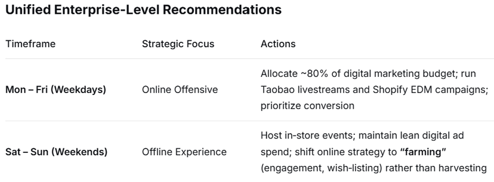

## Summary Statement
> *“The business operates in a dual-speed rhythm: weekdays drive online revenue, while weekends favor offline engagement. With weekday–weekend differences holding below 2% across all channels, the data confirms that time-based adjustments are secondary to channel-based strategies. Marketing, staffing, and promotion calendars should be aligned with this pattern — concentrating digital investment during the workweek and leveraging weekends for in-store differentiation.”*